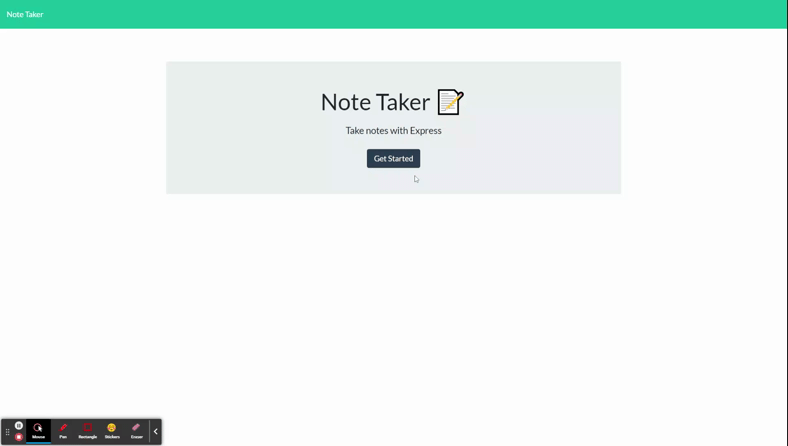

# TakeNotes

## Description 
[TakeNotes](https://quiet-citadel-77202.herokuapp.com/) is a web application powered by nodejs and expressjs served on heroku. The application allows users to save notes to a common .json file.

## Table of Contents 
* [Description](#Description)  
* [Usage](#Usage)  
* [Repo-Contents](#Repo-Contents)  
* [License](#License)  
* [Contributing](#Contributing)   
* [Questions](#Questions)
* [Credits](#Credits)  

## Usage 
Checkout this for demo of the intended functionality.  

Here are some general usage steps
1. From https://quiet-citadel-77202.herokuapp.com/ click get started to go to the notes page.  
2. Add a note title and text
3. Select save. the note will appear on the left. Users may add additional notes.
4. Users may review old notes by clicking on them on the left. From this view users may press the "+" symbol to return to the screen allowing them to add a new note.
5. Users may delete old notes by selecting the trash can next to the note
6. Users may return to the home page by clicking "Note Taker" in te top left

## Repo-Contents
* Server files include:
    * server.js file set up listening/routing
    * api/html routing files
    * empty db.json file for application to push and get data from
    * package.json files 
* Front end files include:
    * html/css for page layout and styling
    * index.js file to handle interaction with the website

## License
TeamTracker is MIT licensed

## Contributing 
Feel free to contribute to this project by forking the repo, making your changes and creating a pull request when you're ready.

## Questions
If you have any questions, contact me:

Email: l.teal21@gmail.com

[GitHub Profile](https://github.com/luketeal)

## Credits
* Front end files are based on information provided by Trilogy Education Services, LLC, a 2U, Inc. brand.